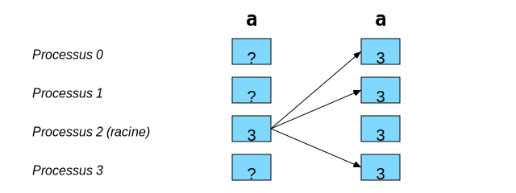
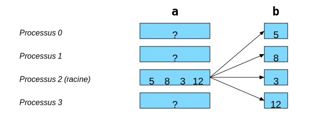
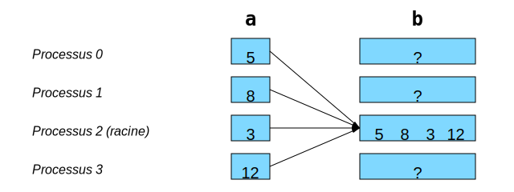
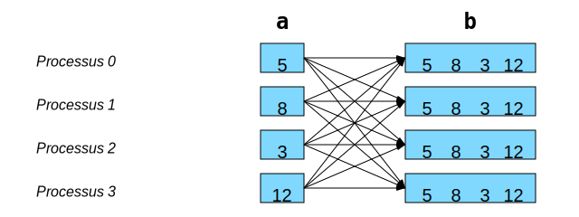
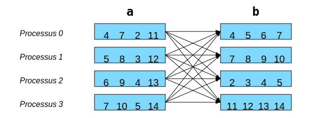

Communications collectives
==========================

`English <../en/collectives.html>`_

Les communications collectives peuvent faire :

- Des **déplacements de données**.

  - ``comm.bcast()``
  - ``comm.scatter()``
  - ``comm.gather()``, ``comm.allgather()``
  - ``comm.alltoall()``

- Des **calculs collectifs**.

  - ``comm.reduce()``, ``comm.allreduce()``

Chaque appel à ces méthodes doit être fait par **tous les processus d’un même
communicateur**.

Déplacements de données
-----------------------

Diffusion de données avec ``bcast``
'''''''''''''''''''''''''''''''''''

Pour envoyer les mêmes informations à tous les processus d’un même
communicateur, on utilise une `méthode
<https://mpi4py.readthedocs.io/en/stable/reference/mpi4py.MPI.Comm.html#mpi4py.MPI.Comm.bcast>`__
effectuant une **diffusion** :

Avec ``mpi4py``, on aurait le code suivant :

.. code-block:: python

    # bcast(objet: Any, racine: int = 0) -> Any

    a = comm.bcast(a, 2)

Distribution de données avec ``scatter``
''''''''''''''''''''''''''''''''''''''''

Pour envoyer une portion des données à chaque processus d’un même
communicateur, on utilise une `méthode
<https://mpi4py.readthedocs.io/en/stable/reference/mpi4py.MPI.Comm.html#mpi4py.MPI.Comm.scatter>`__
effectuant une **distribution** :

Avec ``mpi4py``, on aurait le code suivant :

.. code-block:: python

    # scatter(envoi: Sequence[Any] | None, racine: int = 0) -> Any

    b = comm.scatter(a, 2)

Regroupement de données avec ``gather``
'''''''''''''''''''''''''''''''''''''''

Pour récupérer plusieurs portions de données dans un seul processus d’un
communicateur, on utilise une `méthode
<https://mpi4py.readthedocs.io/en/stable/reference/mpi4py.MPI.Comm.html#mpi4py.MPI.Comm.gather>`__
effectuant un **regroupement** :

Avec ``mpi4py``, on aurait le code suivant :

.. code-block:: python

    # gather(envoi: Any, racine: int = 0) -> list[Any] | None

    b = comm.gather(a, 2)

Regroupement à tous avec ``allgather``
''''''''''''''''''''''''''''''''''''''

C’est l’équivalent de ``gather`` + ``bcast``, mais en `plus efficace
<https://mpi4py.readthedocs.io/en/stable/reference/mpi4py.MPI.Comm.html#mpi4py.MPI.Comm.allgather>`__ :

Avec ``mpi4py``, on aurait le code suivant :

.. code-block:: python

    # allgather(envoi: Any) -> list[Any]

    b = comm.allgather(a)

Transposition globale avec ``alltoall``
'''''''''''''''''''''''''''''''''''''''

C’est l’équivalent de ``scatter`` * ``gather``, mais en `plus efficace
<https://mpi4py.readthedocs.io/en/stable/reference/mpi4py.MPI.Comm.html#mpi4py.MPI.Comm.alltoall>`__ :

Avec ``mpi4py``, on aurait le code suivant :

.. code-block:: python

    # alltoall(envoi: Sequence[Any]) -> list[Any]

    b = comm.alltoall(a)
