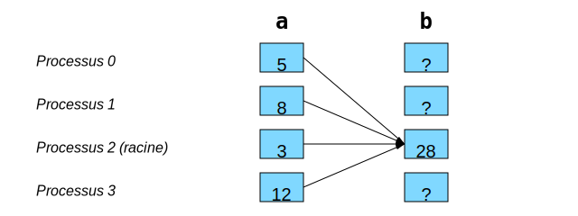

Communications collectives
==========================

`English <../en/collectives.html>`_

Les communications collectives peuvent faire :

- Des **déplacements de données**.

  - ``comm.bcast()``
  - ``comm.scatter()``
  - ``comm.gather()``, ``comm.allgather()``
  - ``comm.alltoall()``

- Des **calculs collectifs**.

  - ``comm.reduce()``, ``comm.allreduce()``

Chaque appel à ces méthodes doit être fait par **tous les processus d’un même
communicateur**.

Déplacements de données
-----------------------

Diffusion de données avec ``bcast``
'''''''''''''''''''''''''''''''''''

Pour envoyer les mêmes informations à tous les processus d’un même
communicateur, on utilise une `méthode
<https://mpi4py.readthedocs.io/en/stable/reference/mpi4py.MPI.Comm.html#mpi4py.MPI.Comm.bcast>`__
effectuant une **diffusion** :

.. figure:: ../images/mpi_bcast_fr.svg

Avec ``mpi4py``, on aurait le code suivant :

.. code-block:: python

    # bcast(objet: Any, racine: int = 0) -> Any

    a = comm.bcast(a, 2)

Distribution de données avec ``scatter``
''''''''''''''''''''''''''''''''''''''''

Pour envoyer une portion des données à chaque processus d’un même
communicateur, on utilise une `méthode
<https://mpi4py.readthedocs.io/en/stable/reference/mpi4py.MPI.Comm.html#mpi4py.MPI.Comm.scatter>`__
effectuant une **distribution** :

Avec ``mpi4py``, on aurait le code suivant :

.. code-block:: python

    # scatter(envoi: Sequence[Any] | None, racine: int = 0) -> Any

    b = comm.scatter(a, 2)

Regroupement de données avec ``gather``
'''''''''''''''''''''''''''''''''''''''

Pour récupérer plusieurs portions de données dans un seul processus d’un
communicateur, on utilise une `méthode
<https://mpi4py.readthedocs.io/en/stable/reference/mpi4py.MPI.Comm.html#mpi4py.MPI.Comm.gather>`__
effectuant un **regroupement** :

.. figure:: ../images/mpi_gather_fr.svg

Avec ``mpi4py``, on aurait le code suivant :

.. code-block:: python

    # gather(envoi: Any, racine: int = 0) -> list[Any] | None

    b = comm.gather(a, 2)

Regroupement à tous avec ``allgather``
''''''''''''''''''''''''''''''''''''''

C’est l’équivalent de ``gather`` + ``bcast``, mais en `plus efficace
<https://mpi4py.readthedocs.io/en/stable/reference/mpi4py.MPI.Comm.html#mpi4py.MPI.Comm.allgather>`__ :

.. figure:: ../images/mpi_allgather_fr.svg

Avec ``mpi4py``, on aurait le code suivant :

.. code-block:: python

    # allgather(envoi: Any) -> list[Any]

    b = comm.allgather(a)

Transposition globale avec ``alltoall``
'''''''''''''''''''''''''''''''''''''''

C’est l’équivalent de ``scatter`` * ``gather``, mais en `plus efficace
<https://mpi4py.readthedocs.io/en/stable/reference/mpi4py.MPI.Comm.html#mpi4py.MPI.Comm.alltoall>`__ :

.. figure:: ../images/mpi_alltoall_fr.svg

Avec ``mpi4py``, on aurait le code suivant :

.. code-block:: python

    # alltoall(envoi: Sequence[Any]) -> list[Any]

    b = comm.alltoall(a)

Calculs collectifs
------------------

Opérations de réduction
'''''''''''''''''''''''

C’est l’équivalent d’un ``gather`` avec une boucle effectuant une opération de
réduction. Voici quelques opérations de réduction :

.. list-table:: Opérateurs de réduction
    :header-rows: 1

    * - Opération
      - Opérateur de type ``MPI.Op``
      - Op([3, 5])
    * - `Maximum
        <https://mpi4py.readthedocs.io/en/stable/reference/mpi4py.MPI.MAX.html>`__
      - ``MPI.MAX``
      - 5
    * - `Minimum
        <https://mpi4py.readthedocs.io/en/stable/reference/mpi4py.MPI.MIN.html>`__
      - ``MPI.MIN``
      - 3
    * - `Somme
        <https://mpi4py.readthedocs.io/en/stable/reference/mpi4py.MPI.SUM.html>`__
      - ``MPI.SUM``
      - 8
    * - `Produit
        <https://mpi4py.readthedocs.io/en/stable/reference/mpi4py.MPI.PROD.html>`__
      - ``MPI.PROD``
      - 15
    * - `ET logique
        <https://mpi4py.readthedocs.io/en/stable/reference/mpi4py.MPI.LAND.html>`__
      - ``MPI.LAND``
      - Vrai
    * - `OU logique
        <https://mpi4py.readthedocs.io/en/stable/reference/mpi4py.MPI.LOR.html>`__
      - ``MPI.LOR``
      - Vrai
    * - `OU exclusif logique
        <https://mpi4py.readthedocs.io/en/stable/reference/mpi4py.MPI.LXOR.html>`__
      - ``MPI.LXOR``
      - Faux
    * - `ET binaire
        <https://mpi4py.readthedocs.io/en/stable/reference/mpi4py.MPI.BAND.html>`__
      - ``MPI.BAND``
      - 1 (011 & 101 = 001)
    * - `OU binaire
        <https://mpi4py.readthedocs.io/en/stable/reference/mpi4py.MPI.BOR.html>`__
      - ``MPI.BOR``
      - 7 (011 | 101 = 111)
    * - `OU exclusif binaire
        <https://mpi4py.readthedocs.io/en/stable/reference/mpi4py.MPI.BXOR.html>`__
      - ``MPI.BXOR``
      - 6 (011 ^ 101 = 110)

Réduction avec ``reduce``
'''''''''''''''''''''''''

Voici un exemple de `réduction
<https://mpi4py.readthedocs.io/en/stable/reference/mpi4py.MPI.Comm.html#mpi4py.MPI.Comm.reduce>`__
effectuant une somme :

Avec ``mpi4py``, on aurait le code suivant :

.. code-block:: python

    # reduce(envoi: Any, op: Op=SUM, racine: int = 0) -> Any | None

    b = comm.reduce(a, MPI.SUM, 2)

Réduction et diffusion avec ``allreduce``
'''''''''''''''''''''''''''''''''''''''''

C’est l’équivalent de ``reduce`` + ``bcast``, mais en `plus efficace
<https://mpi4py.readthedocs.io/en/stable/reference/mpi4py.MPI.Comm.html#mpi4py.MPI.Comm.allreduce>`__ :

.. figure:: ../images/mpi_allreduce_fr.svg

Avec ``mpi4py``, on aurait le code suivant :

.. code-block:: python

    # allreduce(envoi: Any, op: Op=SUM) -> Any

    b = comm.allreduce(a, MPI.SUM)

Division de l’espace de travail
-------------------------------

On se rappelle cette figure vue en :ref:`introduction <intro-espaces-lineaires>` :

.. figure:: ../images/parallel-reduction_fr.svg

La première stratégie consiste à diviser l’espace de travail en portions plus
ou moins égales selon une dimension.

- Or, puisque la taille ``N`` d’une dimension n’est pas nécessairement un
  multiple entier de ``nranks``, on ne peut pas faire une division entière de
  ``N`` par ``nranks`` pour définir une taille unique de portion. On risquerait
  alors d’oublier des éléments à calculer.
- Par contre, on peut utiliser ``rank`` et ``rank + 1`` dans le calcul des
  bornes inférieure et supérieure d’une portion de calcul. Dans l’exemple
  ci-dessous, la borne supérieure ``fin`` du processus ``rank`` correspond à
  la borne inférieure ``debut`` du processus ``rank + 1``, donc aucune
  itération n’est perdue :

  .. code-block:: python

      # Si rank vaut 0 (le premier rang), debut vaut 0
      debut = rank * N // nranks

      # Si rank vaut nranks-1 (le dernier rang), fin vaut N
      fin = (rank + 1) * N // nranks

      # Boucle dans l'intervalle : debut <= k < fin
      for k in range(debut, fin):
          ...
