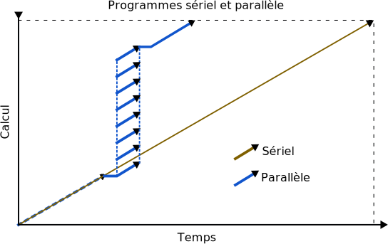
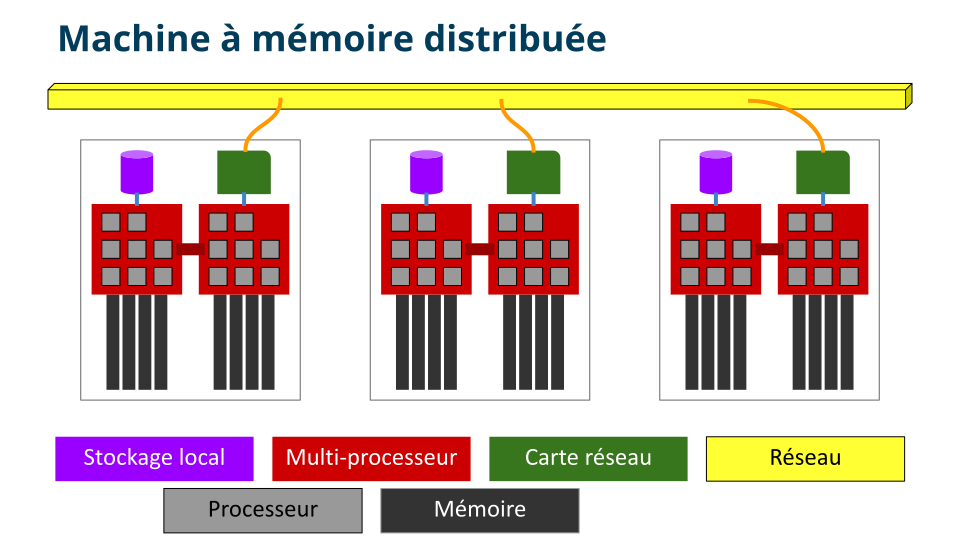
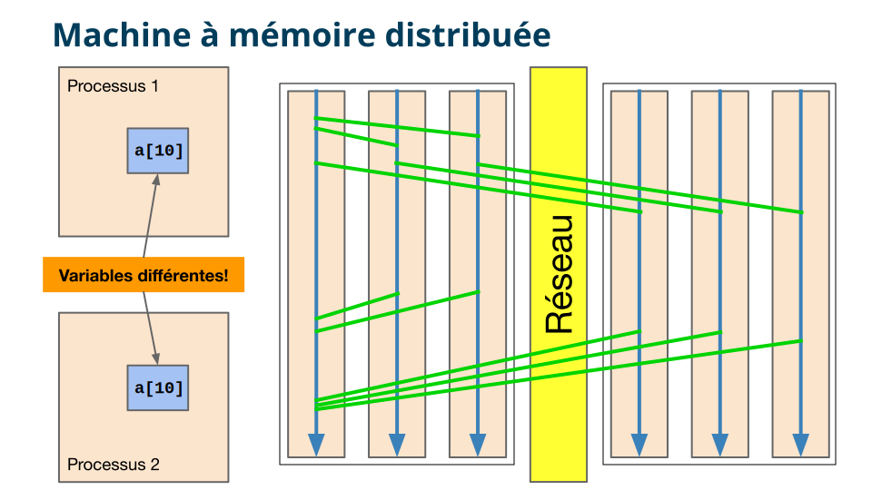

Introduction
============

`English <../en/introduction.html>`_

Il existe deux grandes catégories de tâches de calcul qui travaillent
sur un même problème : les tâches sérielles et les tâches parallèles.

Or, les superordinateurs modernes consistent en un **grand nombre de
serveurs** de calcul contenant chacun **plusieurs processeurs** qui
doivent se **coordonner** pour exécuter un programme parallèle.

.. figure:: https://live.staticflickr.com/65535/49019703558_3c49a9766e.jpg

MPI est la méthode la plus **courante et portable** de
paralléliser un programme s’exécutant sur plusieurs serveurs.

Machine à mémoire distribuée
----------------------------

Des variables en apparence identiques sont en fait des
**instances totalement différentes dans des processus différents**.
Par conséquent, il devient nécessaire d’établir un moyen de
communication entre les processus pour **transférer des données**.

Des questions à se poser
------------------------

- Pourquoi diviser le travail sur plusieurs serveurs?

  - Pour la possibilité d’accélérer un calcul.
  - À cause de la quantité limitée de mémoire vive sur chaque serveur.

- Comment envoyer et recevoir des données entre les processus?

  - C’est ce que nous allons voir dans les chapitres suivants!
